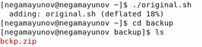
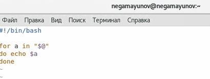
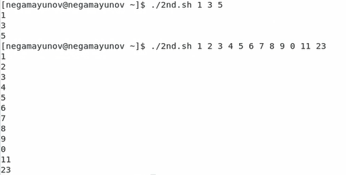
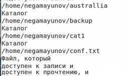

<!-- _class: titleslide -->
# Лабораторная работа №11
### Выполнил Гамаюнов Никита, 1032201719, НПМбд-01-20

---
# Прагматика выполнения работы
**Цель:** Изучить основы программирования в оболочке ОС UNIX/Linux. Научиться писать небольшие командные файлы.

**Задача:** Написать скрипт, который при запуске будет делать резервную копию самого себя, пример командного файла, обрабатывающего любое произвольное число аргументов командной строки, в том числе превышающее десять, командный файл — аналог команды ls (без использования самой этой команды и команды dir), командный файл, который получает в качестве аргумента командной строки формат файла (.txt, .doc, .jpg, .pdf и т.д.) и вычисляет количество таких файлов в указанной директории.

---

# Процесс выполнения работы

1. Написал скрипт, который при запуске делает резервную копию самого себя в архив `bckp.zip` в каталоге `backup`, проверил его работу

        

---

2. Написал пример командного файла, обрабатывающего любое произвольное число аргументов командной строки, в том числе превышающее десять, проверил его работу

    
    

---

3. Написал командный файл — аналог команды ls

      

---

1. Написал командный файл, который получает в качестве аргумента командной строки формат файла и вычисляет количество таких файлов в указанной директории

    

    

---

<!-- _class: titleslide -->
# Выводы
Я изучил основы программирования в оболочке ОС UNIX/Linux и научился писать небольшие командные файлы.